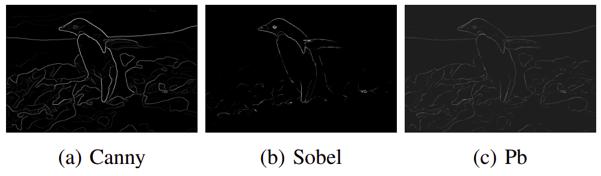
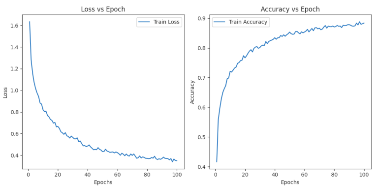
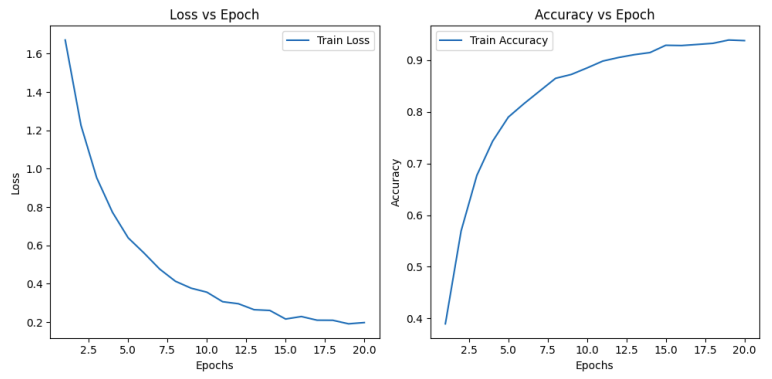
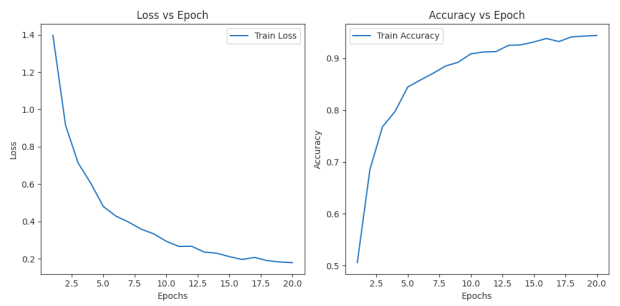

# Edge-Detection-Classical-vs-Deep-Learning

## Overview

| **Phase 1 Results Overview** |  |
|----------|----------|
|  |  |
| Input Image  | Canny, Sobel, Probability of Boundary Image  |

| **Phase 2 Results Overview:** |  |
|----------|----------|
| **Loss & Accuracy Plots**| **Loss & Accuracy Plots** |
|  |  |
| Simple Neural Network | ResNet  |
|  |  |
| ResNext | DenseNet  |

This project involves two main phases: boundary detection and deep learning model implementation and comparison. The objective is to enhance edge detection techniques and explore various neural network architectures on the CIFAR-10 dataset.

## Phase 1: Shake My Boundary
### Objective
To implement and improve the Probability of Boundary (pb) detection algorithm, which considers texture, brightness, and color discontinuities for more accurate edge detection.

### Methodology
1. **Filter Banks Creation**:
   - Utilized Oriented Difference of Gaussian (DoG) Filters, Leung-Malik (LM) Filters, and Gabor Filters to extract texture properties.

2. **Texton, Brightness, and Color Map Creation**:
   - Applied filter banks and k-means clustering to generate maps representing texture, brightness, and color changes.

3. **Texton, Brightness, and Color Gradients Calculation**:
   - Used half-disk masks and Chi-Square distance to compute gradients.

4. **Probability of Boundary Calculation**:
   - Integrated gradient information with Sobel and Canny edge detection results to produce pb edges, reducing noise and improving accuracy.

## Phase 2: Deep Dive on Deep Learning
### Objective
To implement and compare multiple neural network architectures on the CIFAR-10 dataset, evaluating their performance based on accuracy and loss.

### Methodology
1. **Neural Network Architectures**:
   - Simple Neural Network
   - ResNet
   - ResNext
   - DenseNet

2. **Training Configuration**:
   - 20 epochs
   - Mini-batch size of 30
   - AdamW optimizer
   - Learning rate of 0.0001
   - Weight decay of 0.01

3. **Comparison**:
   - Models were trained with and without data transformations.
   - Performance evaluated based on the number of parameters, accuracy, and loss.

### Strategies for Improvement
- Hyperparameter tuning
- Data augmentation
- Ensemble learning
- Transfer learning
- Architecture modifications
- Regularization techniques
- Learning rate schedule adjustments

## Results
- The pb detection algorithm showed reduced noise and improved edge detection accuracy compared to classical methods.
- Among the deep learning models, different architectures exhibited varying levels of accuracy and efficiency, with DenseNet showing the best performance in some scenarios.
- A detailed analysis of all results is available in **[Report.pdf](./Report.pdf)**.

## Conclusion
This project successfully implemented advanced boundary detection techniques and compared multiple neural network architectures, providing insights into their effectiveness on the CIFAR-10 dataset.

## Author
Abhijeet Sanjay Rathi

## Acknowledgments
Special thanks to the Computer Vision course instructors and teaching assistants for their guidance and support.
